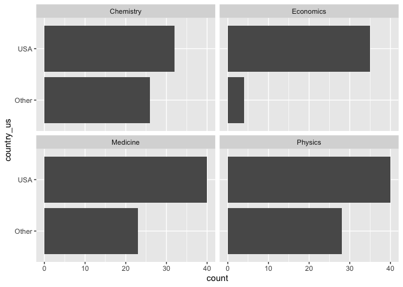
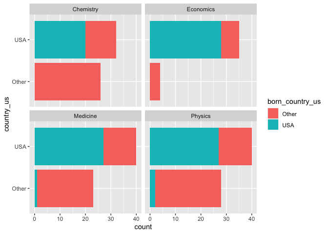

Lab 03 - Nobel laureates
================
Shatavia Bellmon
1-31-26

### Load packages and data

``` r
library(tidyverse) 
```

``` r
nobel <- read_csv("data/nobel.csv")
```

## Exercises

Here is a link to the [lab
instructions](https://datascience4psych.github.io/DataScience4Psych/lab03.html).

### Exercise 1

view(nobel)

The nobel dataset contains 935 observations and 26 variables. Each row
represents a a Nobel Prize winner and their information such as why they
won the award and personal demographics.

### Exercise 2

``` r
nobel_living <- nobel %>% 
  filter(
    is.na(died_date),
    !is.na(country),
    gender != "org"
  )
```

After filtering for living laureates with available country data and
excluding organizations, the resulting data frame contains 228
observations.

### Exercise 3

``` r
nobel_living <- nobel_living %>%
  mutate(
    country_us = if_else(country == "USA", "USA", "Other")
  )
```

``` r
nobel_living_science <- nobel_living %>%
  filter(category %in% c("Physics", "Medicine", "Chemistry", "Economics"))
```

``` r
ggplot(nobel_living_science, aes(x = country_us)) +
  geom_bar() +
  facet_wrap(~ category) +
  coord_flip()
```

<!-- -->

In every category represented in this faceted bar plot, there are more
nobel prize winners who were in the USA when they won their award than
there are nobel prize winners who were outside the USA when they won
their award. This supports BuzzFeed’s claim that “most living Nobel
laureates were based in the US when they won their prizes”.

### Exercise 4

``` r
nobel_living_science <- nobel_living_science %>%
  mutate(
    born_country_us = if_else(born_country == "USA", "USA", "Other")
  )
```

``` r
nobel_living_science %>%
  filter(born_country_us == "USA") %>%
  nrow()
```

    ## [1] 105

105 winners were born in the US.

### Exercise 5

``` r
ggplot(nobel_living_science, aes(x = country_us, fill = born_country_us)) +
  geom_bar() +
  facet_wrap(~ category) +
  coord_flip()
```

<!-- -->

The data does not appear to support Buzzfeed’s claim. Most of the US
based Nobel laureates were born in the USA.

### Exercise 6

…
